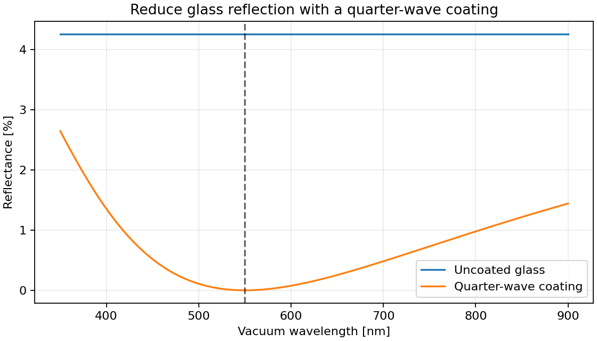

Design an antireflection coating in Python
==========================================

Choose the refractive index and thickness of an ideal single-layer coating,
then compare coated and uncoated glass. The plot shows the reflection minimum
at the 550 nm design wavelength.

   Ideal quarter-wave coating compared with bare glass at normal incidence.

.. image:: https://colab.research.google.com/assets/colab-badge.svg
   :target: https://colab.research.google.com/github/MartinPdeS/PyOptik/blob/master/docs/tutorials/antireflection_coating.ipynb
   :alt: Open in Colab

Run the notebook with **Runtime → Run all**, or download the
:download:`notebook <../../tutorials/antireflection_coating.ipynb>` or
:download:`Python script <../../tutorials/antireflection_coating.py>` to run locally.

Run locally
-----------

.. code-block:: bash

   python -m pip install PyOptik
   python antireflection_coating.py

No material database download is needed for this ideal coating example.

Calculate and plot
------------------

.. literalinclude:: ../../tutorials/antireflection_coating.py
   :language: python

Understand the result
---------------------

At normal incidence, an ideal coating between air and a lossless substrate
has index :math:`n_c = \sqrt{n_0 n_s}` and thickness
:math:`d = \lambda_0/(4n_c)`. Here :math:`n_0=1` and :math:`n_s=1.52`, giving
:math:`n_c \approx 1.233` and :math:`d \approx 111.5` nm. Reflections from
the two coating interfaces cancel at the design wavelength.

The index is an ideal design value, not a selected real coating material.
The calculation assumes constant, lossless indices, a coherent isotropic
layer, and normal incidence. A practical coating should use a measured
material model and account for dispersion and manufacturing constraints.

Try another design
------------------

Change ``design_wavelength`` to 800 nm and rerun the plot. Then replace
``coating_index`` with 1.38 to see how an imperfect index match changes
the minimum reflectance.

See :doc:`../conventions` for physical conventions and
:doc:`../materials_and_catalog` for source selection and provenance.
