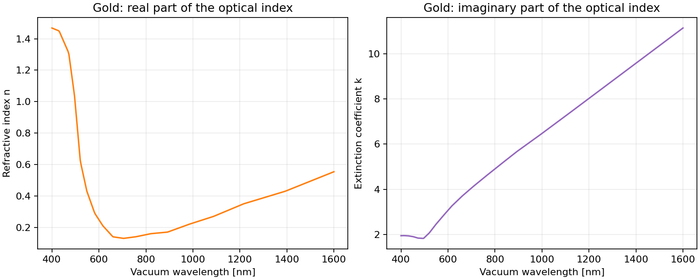

Plot gold’s refractive index and extinction coefficient in Python
=================================================================

Load measured gold optical constants and plot the real refractive index
and extinction coefficient separately. Use these wavelength-dependent values
as inputs to material, interface, or electromagnetic calculations.

   Optical constants from the Johnson and Christy gold dataset.

.. image:: https://colab.research.google.com/assets/colab-badge.svg
   :target: https://colab.research.google.com/github/MartinPdeS/PyOptik/blob/master/docs/tutorials/gold_optical_constants.ipynb
   :alt: Open in Colab

Run the notebook with **Runtime → Run all**, or download the
:download:`notebook <../../tutorials/gold_optical_constants.ipynb>` or
:download:`Python script <../../tutorials/gold_optical_constants.py>` to run locally.

Run locally
-----------

.. code-block:: bash

   python -m pip install PyOptik
   python gold_optical_constants.py

The script downloads the RefractiveIndex.INFO snapshot on first use.
This needs internet access; subsequent runs reuse the local cache.

Calculate and plot
------------------

.. literalinclude:: ../../tutorials/gold_optical_constants.py
   :language: python

Understand the result
---------------------

PyOptik uses the convention :math:`\tilde n = n + i k`. The real part
:math:`n` describes phase propagation, while the positive extinction
coefficient :math:`k` describes attenuation. The intensity absorption
coefficient is :math:`\alpha = 4\pi k/\lambda`, with vacuum wavelength
:math:`\lambda`.

The canonical identifier ``main/Au/Johnson`` selects the Johnson and Christy
dataset explicitly. Tabulated values are interpolated between source points;
``out_of_range="raise"`` prevents extrapolation outside the published range.
These are bulk optical constants; films can differ with fabrication and
measurement conditions. Cite the original measurement when using this data.

Try another design
------------------

Replace ``main/Au/Johnson`` with ``main/Ag/Johnson`` to compare gold and
silver over the same wavelength range. Use ``gold.absorption_coefficient``
to express attenuation as an inverse length.

See :doc:`../conventions` for physical conventions and
:doc:`../materials_and_catalog` for source selection and provenance.
