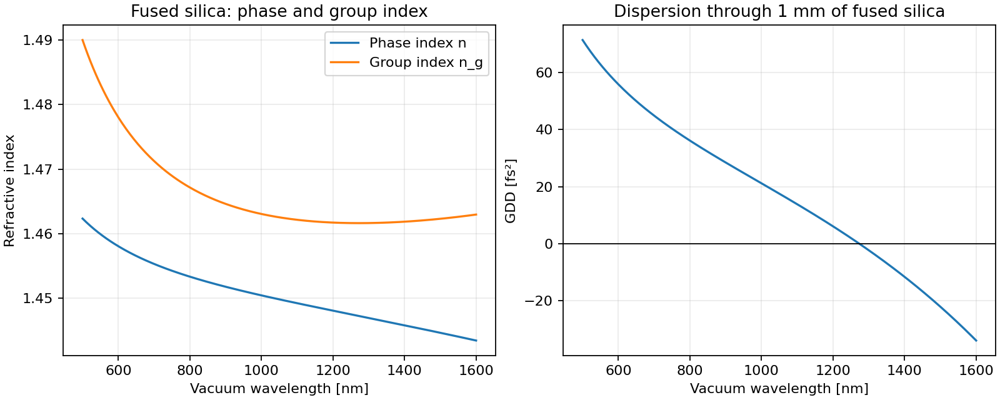

Calculate silica group index and dispersion in Python
=====================================================

Compare phase index with group index and calculate the group-delay dispersion
(GDD) through 1 mm of fused silica. The plots below show why the index used for
phase propagation differs from the index used for pulse arrival time.

   Group index and GDD from the Malitson fused-silica model.

.. image:: https://colab.research.google.com/assets/colab-badge.svg
   :target: https://colab.research.google.com/github/MartinPdeS/PyOptik/blob/master/docs/tutorials/silica_dispersion.ipynb
   :alt: Open in Colab

Run the notebook with **Runtime → Run all**, or download the
:download:`notebook <../../tutorials/silica_dispersion.ipynb>` or
:download:`Python script <../../tutorials/silica_dispersion.py>` to run locally.

Run locally
-----------

.. code-block:: bash

   python -m pip install PyOptik
   python silica_dispersion.py

The script downloads the RefractiveIndex.INFO snapshot on first use.
This needs internet access; subsequent runs reuse the local cache.

Calculate and plot
------------------

.. literalinclude:: ../../tutorials/silica_dispersion.py
   :language: python

Understand the result
---------------------

The group index is :math:`n_g = n - \lambda\,dn/d\lambda`, and the group
velocity is :math:`c/n_g`. GDD is :math:`d\tau_g/d\omega` for a specified
propagation length. It describes how group delay changes with angular
frequency and is reported here in fs². Doubling the length doubles the GDD;
it does not change the group index.

This example uses the Malitson fused-silica Sellmeier model. The 500–1600 nm
interval stays within its source validity range and leaves room for the
finite differences used to calculate derivatives. GDD is a numerical
derivative: check convergence if you need high precision. This describes
bulk material dispersion, without waveguide dispersion.

Try another design
------------------

Change ``length`` to 10 mm and compare GDD. Then evaluate the group delay
at 800 nm with ``silica.compute_group_delay(800 * ureg.nanometer, length=length)``.

See :doc:`../conventions` for physical conventions and
:doc:`../materials_and_catalog` for source selection and provenance.
